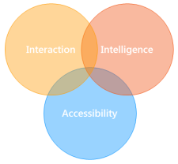

# Research Focus

Research activities of the e-Lite group focus on designing, building and evaluating interactive and intelligent systems,
and testing them in realistic settings. Novel user interaction modalities, empowered by ubiquitous devices, enable the
discovery of innovative methods to approach new and existing application domains. We adopt an end-to-end research
approach, where we aim at exploring the whole spectrum, from devices to users, from intelligence to data representation,
to develop a systemic approach.

Currently, the application area in which we are mostly active is *Ambient Intelligence*.

Ambient Intelligence (AmI) aims at building a digital environment where people are surrounded by intelligent and
intuitive interfaces embedded in all kinds of objects. The ultimate goal of such an environment is to support people in
their daily lives in a proactive, yet sensible and unobtrusive, way.

In this wide area, we mainly focus on innovative **interaction modalities** for people and on the intelligent aspects (e.g.,
Semantic Web) of the environment, typically exploiting off-the-shelf devices and systems from the Internet of Things and
Smart Home domains. We are also interested in understanding how to effectively support developers to build such systems.

Moreover, we deserve particular attention to the Ambient Assisted Living field, in which **Accessibility** and Assistive
Technologies meets AmI. In this domain, we experiment with novel interaction modalities and systems for people with
disabilities.
