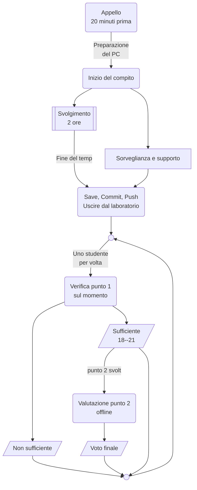

# Esame

## Esercizi d'esame

Tutti i temi d'esame degli anni accademici precedenti sono disponibili sul repository:
- https://github.com/TdP-esami

## Regole d'esame

### Svolgimento dell'esame

### Istruzioni per l'utilizzo di GitHub Classroom
