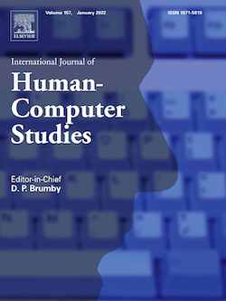

# Special Issue: Understanding Digital Wellbeing within Complex Technological Contexts

The International Journal of Human Computer Studies (IJHCS) issued a special issue on the topic "Understanding Digital Wellbeing within Complex Technological Contexts".

<!-- truncate -->

Nowadays, there is a growing — yet debated — discussion around the negative aspects of overusing technology, with many people that feel conflicted about the amount of time they spend on their devices. In this context, researchers and practitioners have started to consider a new kind of psychological digital wellbeing, giving rise to the flourishing of digital self-control tools (DSCTs), i.e., external applications that support users in self-regulating their technology use through interventions like timers and lock-out mechanisms.
Currently, the digital wellbeing topic is nearly always contextualized to consider single technological sources at a time, with a prevalence of studies and DSCTs that focus on smartphones only. As many people nowadays own (and use) several devices, however, there is a need to better understand their complex and overlapping use (and non-use), and the relationships to other people's digital wellbeing.

The purpose of this special issue is to provide the academic and industry research communities a venue for work at the state-of-the-art on digital wellbeing and DSCTs, with a particular focus on digital wellbeing within complex technological contexts.

Submissions are open until February 15, 2022. Submissions can be made at the journal submission website at https://www.editorialmanager.com/ijhcs/default.aspx, by selecting the special issue.

Guest editors:

* Luigi De Russis, Politecnico di Torino, Italy
* Alberto Monge Roffarello, Politecnico di Torino, Italy
* Danielle Lottridge, University of Auckland, Aotearoa New Zealand
* Marta E. Cecchinato, University of Northumbria, UK

More information:

* [International Journal of Human Computer Studies](https://www.sciencedirect.com/journal/international-journal-of-human-computer-studies) main page
* Special issue [introduction and accepted papers](https://www.sciencedirect.com/journal/international-journal-of-human-computer-studies/special-issue/10ZXKXF2TCX)

