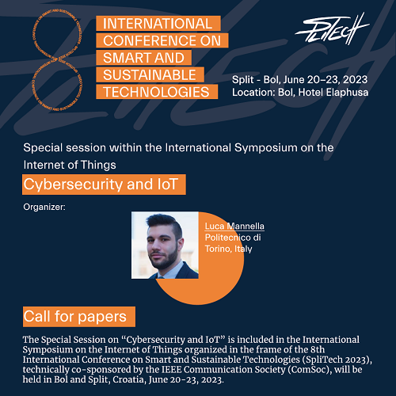

# Call for Papers: Special Session on Cybersecurity and IoT @ SpliTech 2023

The e-Lite research group is organizing a **special session** focused on **Cybersecurity** and the **Internet of Things
** (IoT).

The poster of the special session, with all the relevant information, is available at the following
link: https://2023.splitech.org/assets/SS%20Cybersecurity.pdf

<!-- truncate -->

This special session aims to explore cutting-edge advancements in cybersecurity as it pertains to the Internet of
Things. Attendees will have the chance to engage in discussions and exchange ideas on the latest applications, design
challenges, solutions, research findings, and ongoing work in this vital field of technology.

The special session on “Cybersecurity and IoT” will be part of the **International Symposium on the Internet of Things**
organized in the frame of the 8th
International Conference on Smart and Sustainable Technologies ([SpliTech 2023](https://2023.splitech.org/home)),
technically co-sponsored by
IEEE [Communication Society](https://www.comsoc.org/conferences-events/international-conference-smart-and-sustainable-technologies-2023) (
ComSoc).
The conference will be held in **Bol** and **Split**, **Croatia**, June 20-23, 2023.

Submissions are open until February 24, 2023, at the following link, by selecting the symposium ("SYM_IOT") and our
special issue ("**`SS_CYBER`**"):
https://www.edas.info/newPaper.php?c=30289&track=114859

Accepted and presented papers will be published in the conference proceedings and submitted to **IEEE Xplore** as well
as other Abstracting and Indexing (A&I) databases. Authors of selected best papers will be invited to submit an extended
version of their manuscripts for publication in a special issue of some international and indexed journals.

For any needs, feel free to contact [Luca Mannella](https://www.polito.it/en/staff?p=luca.mannella) at his e-mail address: _name(
dot)surname(at)polito(dot)it_

More information:

- [Submit your paper](https://www.edas.info/newPaper.php?c=30289&track=114859)
- CfP: [Special Session on Cybersecurity and IoT](https://2023.splitech.org/assets/SS%20Cybersecurity.pdf)
- CfP: [International Symposium on the Internet of Things](https://2023.splitech.org/assets/SYM%20IoT%20F.pdf)
- [SpliTech 2023 website](https://2023.splitech.org/home)