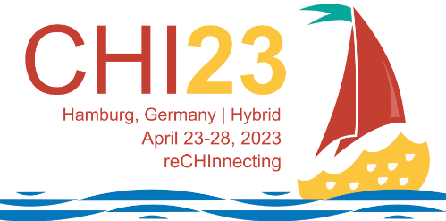

# Participation at ACM CHI 2023

We are happy to announce that we have one full paper and a Late-Breaking Work (LBW) accepted at [ACM CHI 2023](https://chi2023.acm.org), the premier international conference of Human-Computer Interaction. CHI 2023 will be held next week (April 23-28) in Hamburg (Germany) and online. 

Luigi, Alberto, Juan, and Tommaso will attend the conference in person. If you meet any of us, say "hello": we're always happy to chat! 😊

The paper is about **digital wellbeing** and [attention-capture damaging patterns](http://attentioncapture.com), while the LBW presents a first step towards better understanding **creative coders'** needs.

<!-- truncate -->

### Defining and Identifying Attention Capture Deceptive Designs in Digital Interfaces
The paper "_Defining and Identifying Attention Capture Deceptive Designs in Digital Interfaces_" will be presented on Wednesday, **26 April** at 11:10 (session: Digital Wellbeing). The work is a collaboration between the e-Lite group and the [Human-Computer Interaction Lab](https://kailukoff.com) at Santa Clara University, CA (USA).

In the paper, we conducted a systematic literature review for what we call 'attention capture damaging patterns' (ACDPs). We analyzed 43 papers to identify their characteristics, the psychological vulnerabilities they exploit, and their impact on digital wellbeing. We propose a definition of ACDPs and identify eleven common types, from Time Fog to Infinite Scroll. Our typology offers technologists and policymakers a common reference to advocate, design, and regulate against attentional harms.

Read the paper by following the links at the end of this news, and watch the [10-mins video presentation](https://youtu.be/Bw9m8j3_jJ0) on YouTube (also, below)!

<iframe width="560" height="315" src="https://www.youtube-nocookie.com/embed/Bw9m8j3_jJ0" title="YouTube video player" frameBorder="0" allow="accelerometer; autoplay; clipboard-write; encrypted-media; gyroscope; picture-in-picture; web-share" allowFullScreen></iframe>

### The Art of Creating Code-Based Artworks
The Late-Breaking Work, instead, "_The Art of Creating Code-Based Artworks_" will be discussed on Wednesday, **26 April** at 10:30. This work stems from a collaboration with the [Vrije Universiteit Amsterdam](https://maveme.github.io), and will be presented by all the authors.

This paper reports on an in-depth interview with 5 code artists with diverse backgrounds, levels of experience, and working on different code-based artistic expressions. Through their experience, we identified characteristics and commonalities in their development process, the tools they use, their sources of inspiration, and their expectations. Accordingly, we reflect on the particularities of Creative Coding, indicate commonalities with other domains, and suggest opportunities and challenges for HCI researchers and practitioners in proposing tools to support it better.
Read it by following the links below!

---

Additional information:

* _Defining and Identifying Attention Capture Deceptive Designs in Digital Interfaces_ by Alberto Monge Roffarello, Kai Lukoff, and Luigi De Russis
  * [Get it from PORTO@IRIS](https://hdl.handle.net/11583/2974641)
  * [Read it on the ACM DL](https://doi.org/10.1145/3544548.3580729)
* _The Art of Creating Code-Based Artworks_ by Mauricio Verano Merino, Juan Pablo Sáenz
  * [Get it from PORTO@IRIS](https://hdl.handle.net/11583/2976495)
  * [Read it on the ACM DL](https://doi.org/10.1145/3544549.3585743)
* [Full conference program](https://programs.sigchi.org/chi/2023)
