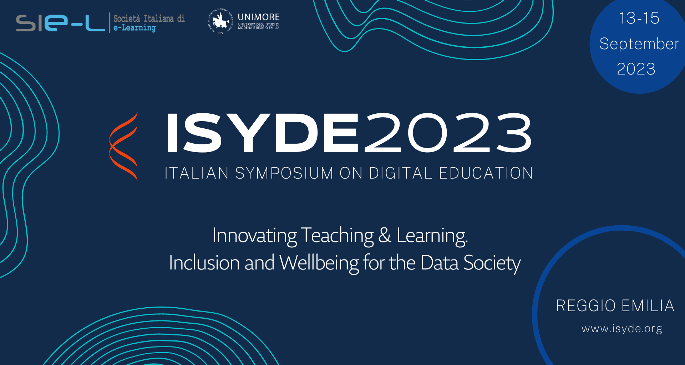
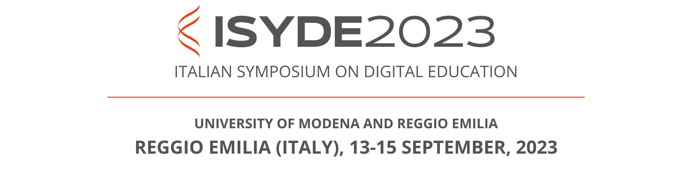

# Participation to ISYDE 2023

The 2023 edition of the **Italian Symposium on Digital Education** (ISYDE), organized by the Italian e-Learning Society (SIe-L), is planned in Reggio Emilia (Italy) on September 13-15. From the e-Lite group, Fulvio will participate in the special plenary session **Blending strategies in universities: methods, technologies and policies**, that focuses on the adoption of blending learning technologies on some major Italian universities.

<!-- truncate -->

The special session will describe the result of a survey, across 10 major Italian universities, of the practices and experiences in delivering *blended learning* courses in their institutional offers. The speakers will present the data stemming from the survey and reflect on their significance and perspectives, also on the light of the Digital Education Hub initiatives. The session is organized and coordinate by Susanna Sancassani from the METID center of Politecnico di Milano.

Contents of the Special Plenary Session:

- Strategie di blending nelle università: la ricerca, *Susanna Sancassani*
- Una piattaforma collaborativa per la raccolta dati su esperienze di blended learning in ambito universitario, *Gianni Fenu*
- Analisi dei formati didattici per lo sviluppo di soluzioni blended di qualità, *Chiara Panciroli, Lorella Giannandrea*
- Strumenti tecnologici: diffusione ed impatto, *Fulvio Corno*
- La governance dei processi (regolamenti e direttive), *Sabina Rossi, Matteo Ferrini*
- Esperienze di digital learning: presentazione e riflessioni su casi studio all’Università di Messina, Pisa e Trento, *Angela Maria Mezzasalma, Federica Paganelli, Alessandro Iannella, Daniele Agostini*

More information:

* [ISYDE 2023 conference website](https://www.isyde.org/)
* [Full Conference Programme](https://www.conftool.org/isyde2023/sessions.php)

