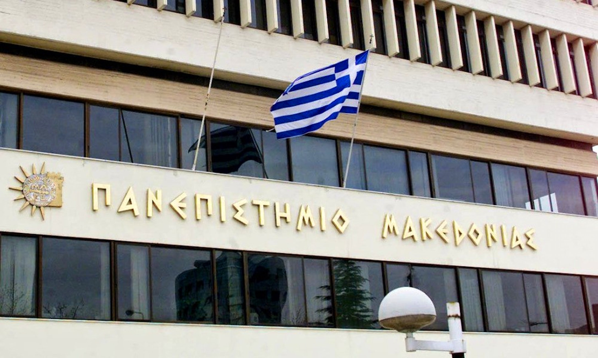

# AccessCoVE kickoff meeting at University of Macedonia

AccessCoVE (European Centre of Vocational Excellence in Accessibility) is an Erasmus+ project that aims to structure excellence in Vocational Education and Training in the field of Accessibility. Twenty-five partners from four different countries (Greece, Sweden, Spain, and Italy) joined their forces to establish a European multi-level innovative and constantly growing Centre of Vocational Excellence - 
the **AccessCoVE** - in the field of accessibility for individuals with disabilities (i.e. individuals with impairments and elders). The project is coordinated by prof. Konstantinos Papadopoulos from University of Macedonia (Thessaloniki, Greece).

On Semptember 28 and 29, 2023, the project held its first (*kickoff*) meeting at University of Macedonia. Fulvio and Laura participated to the meeting, well coordinated by prof. Eleni Koustriava (Ελένη Κουστριάβα), where all the project partners (in presence or remotely) shared their view about the project workpackages, and planned the activity for the first period of the project.

More information will be available soon on the project website (currently under construction). The next plenary meeting will be in June 2024, and will be hosted by Politecnico di Torino.