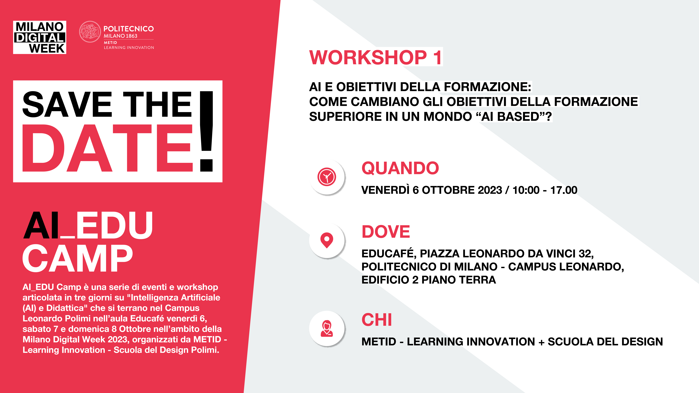

# AI_EDU CAMP Workshop su AI e Obiettivi della Formazione

All’interno della Milano Digital Week, il Politecnico di Milano realizza [AI_EDU CAMP](https://www.eventi.polimi.it/events/milano-digital-week-ai_edu-camp/):
un palinsesto articolato di workshop, talk, eventi performativi per riflettere in modo approfondito sul futuro della didattica con l’AI e preparare insegnanti, formatori e studenti ad un suo utilizzo efficace e sostenibile.

Le iniziative sono progettate e gestite da METID “Innovation Teaching and Learning” e Scuola del Design del Politecnico di Milano e il Collettivo AAA (alumni Polimi).

<!-- truncate -->

Tra gli eventi previsti dal programma, il "Workshop 1" è un momento in cui un gruppo selezionato di esperti riflette sull’evoluzione degli obiettivi della formazione superiore. Le domande che si porranno sono: dovranno cambiare in un mondo in cui mestieri, professioni, modi della cittadinanza saranno pervasi dall’AI? Se la risposta è sì, in quali direzioni? Se la risposta è no, perché è importante che non cambino?

Al workshop, a cui parteciperà Fulvio Corno in qualità di esperto, mirerà allo sviluppo creativo di idee, utilizzando metodologie di design strategico.