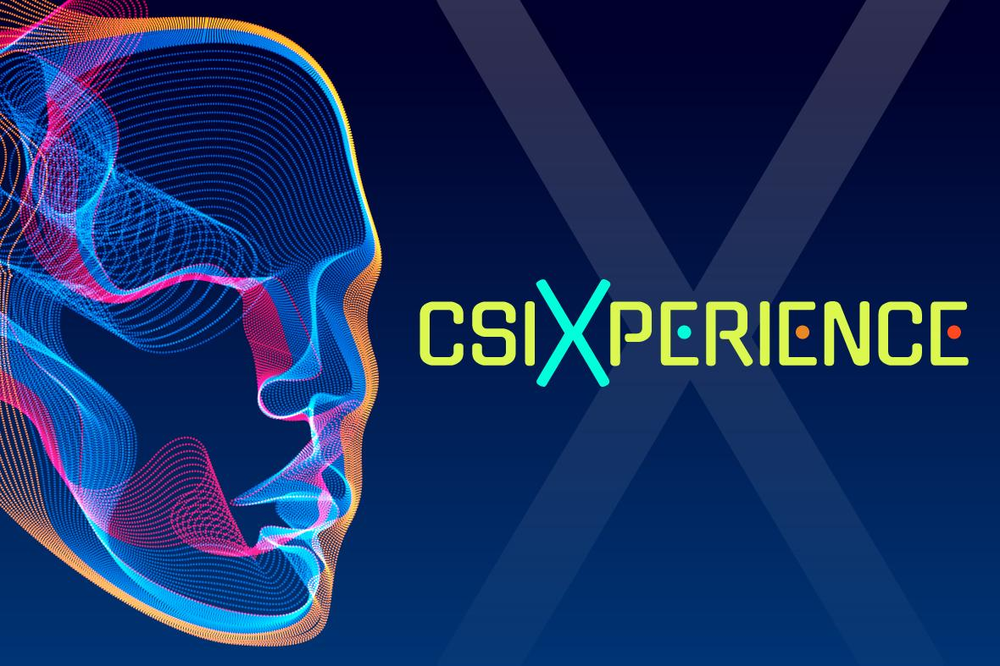

# Convegno CSI: Intelligenza artificiale o aumentata?

L’intelligenza artificiale trova già applicazione in molti settori, come la sanità, i trasporti, la didattica e l’intrattenimento. Più interagiamo con questi strumenti, meglio riusciamo a valutarne l’impatto economico e sociale e a guidarne l’evoluzione, regolamentando anche gli aspetti etici. 

Il CSI Piemonte inaugura un nuovo formato di convegno, denominato "CSI Xperience", sul tema della Intelligenza Artificiale e delle sue relazioni con la società.
L'evento è previsto per il **17 ottobre 2023** ed è aperto da Fulvio Corno, attuale presidente del Comitato Tecnico Scientifico del CSI.

<!-- truncate -->

L'evento è organizzato in due fasi:

- [Intelligenza artificiale o aumentata? Verso una nuova relazione tra uomo e macchina](https://www.csipiemonte.it/it/evento/intelligenza-artificiale-aumentata): convegno in presenza ed in streaming con l'intervento di relatori esperti di AI nella Pubblica Amministrazione, nel Lavoro ed Etica, nell'Educazione e Didattica, nell'Arte e Creatività. Il convegno sarà 
- [L'intelligenza artificiale vista da vicino](https://www.csipiemonte.it/it/evento/lintelligenza-artificiale-vista-vicino): Percorsi guidati con ingressi ogni ora in CSI Next, sede della Casa delle Tecnologie Emergenti di Torino. Robot, assistenti virtuali, giochi e chat basate su AI generativa, musica e film.

Maggiori informazioni:

- [Programma del convegno (17/10, mattina)](https://www.csipiemonte.it/it/evento/intelligenza-artificiale-aumentata)
- [Programma delle esperienze pratiche (17/10, pomeriggio)](https://www.csipiemonte.it/it/evento/lintelligenza-artificiale-vista-vicino)