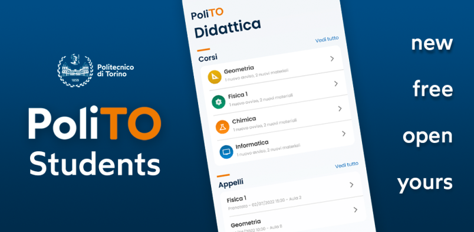

import icon from './icona_poliTOstudents.png'

# Lanciata la nuova PoliTO Students App

Il Politecnico di Torino lancia oggi la prima versione pubblica della propria applicazione mobile per gli studenti, denominata `PoliTO Students`, per i sistemi operativi Android e iOS.

La nuova applicazione, sviluppata da zero con tecnologia *React Native*, è nata grazie allo sforzo congiunto dei tecnici della Direzione ISIAD e dei professori del Dipartimento DAUIN, affiancati da valenti studenti ed ex-studenti di Ingegneria Informatica. Il percorso di progettazion e sviluppo dell'applicazione, iniziato circa 18 mesi fa, ha seguito un *processo aperto e collaborativo*, coinvolgendo in tutte le fasi gli *utenti finali* (studenti, ex studenti e futuri studenti) attraverso interviste, focus group, e test di usabilità di mockup e prototipi. L'interfaccia utente è stata *completamente ridisegnata* partendo dalle esigenze quotidiane di studenti e studentesse, approdando ad un design moderno e flessibile.

I principali progettisti e sviluppatori della App sono stati *due studenti di Ingegneria Informatica*, Luca Pezzolla ed Umberto Pepato (supervisionati da Fulvio Corno), che hanno svolto la propria tesi di Laurea Magistrale sul tema, ed hanno continuato a lavorare con il Politecnico dopo la Laurea Magistrale per portare a termine il progetto.

<!-- truncate -->

Non si tratta solo di una App mobile, ma di una *porta di accesso* ai molti servizi e informazioni che i Sistemi Informativi del Politecnico di Torino mettono a disposizione dei propri studenti: carico didattico, lezioni, appelli, scadenze, mappe, luoghi, aule, ticket, sicurezza, biblioteche, prenotazioni, materiale, video lezioni, consegne, ... Ciascuno di questi aspetti è *perfettamente integrato* nella App ed esiste grazie alla collaborazione dei programmatori che gestiscono il Sistema Informativo, che hanno contribuito riprogettando le *API* (che ora sono pubbliche e documentate) e costruendo  *flussi* informativi totalmente nuovi (come nel caso della cartografia).

Tutto il processo è stato condotto nella logica dell'*Open Source*, tutto il codice e la documentazione sono liberamente ispezionabili e riutilizzabili. Gli studenti e gli altri utilizzatori sono invitati a segnalare malfunziomanemtni (tramite *issue* o *ticket*) o a suggerire nuove funzionalità. Ciò ha portato anche all'apertura della pagina ufficiale del Politecnico di Torino su GitHub.

Maggiori informazioni:

- [Comunicato ufficiale di lancio dell'ateneo](https://www.polito.it/ateneo/comunicazione-e-ufficio-stampa/poliflash/lanciata-la-nuova-polito-students-app)
- [Pagina descrittiva delle App del Politecnico](https://www.polito.it/ateneo/comunicazione-e-ufficio-stampa/polito-app)
- [Scaricamento Versione Android](https://play.google.com/store/apps/details?id=it.polito.students)
- [Scaricamento della versione iOS](https://apps.apple.com/us/app/polito-students/id6443913305)
- [Pagina GitHub del progetto PoliTO Students](https://github.com/polito/students-app)
- [Profilo GitHub del Politecnico di Torino](https://github.com/polito/)