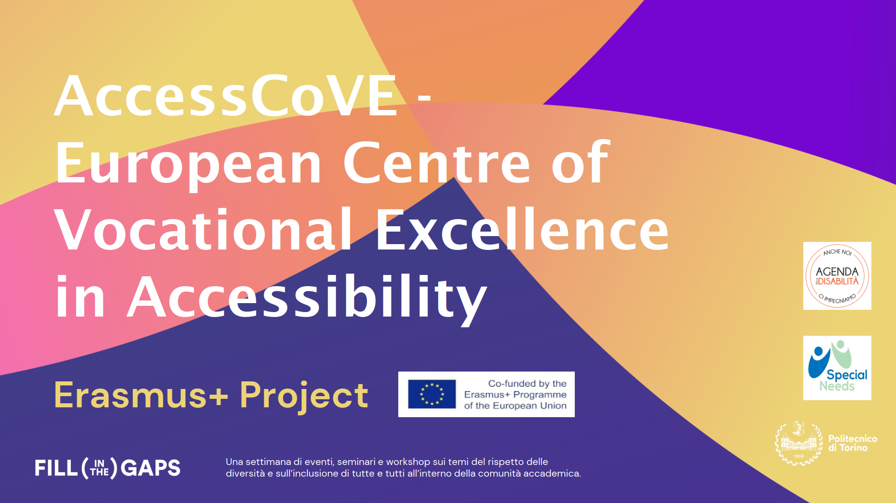

# Presentation of Erasmus+ project AccessCoVE

The project  [AccessCoVE](/research/collaborative-projects/AccessCoVE) aims to structure excellence in Vocational Education and Training in the field of Accessibility, by establishing a European multi-level innovative and constantly growing Centre of Vocational Excellence - the AccessCoVE - in the field of accessibility for individuals with disabilities.

On November 30, 2023, Politecnico di Torino organized an event on the topic of "Disability, Research, and Intersectionality", with talks by several researchers and professors who are actively involved in the field of accessibility. The event was organized in occasion of the International Day of rights of persons with disabilities.

In that context, we held a short presentation of the AccessCoVE project, its partners, its objectives, and the ways in which the project will involve the whole research community of Politecnico di Torino, and other national associations and research centers.

<!-- truncate -->

Maggiori informazioni:

- [Project description](/research/Projects/AccessCoVE)
- [Official project website](https://accesscove.org/)
- [Presentation of the Fill In The Gaps event](https://www.polito.it/ateneo/comunicazione-e-ufficio-stampa/appuntamenti/news?idn=21896)
- [AccessCoVE dissemination events](/research/Projects/AccessCoVE/dissemination/)
