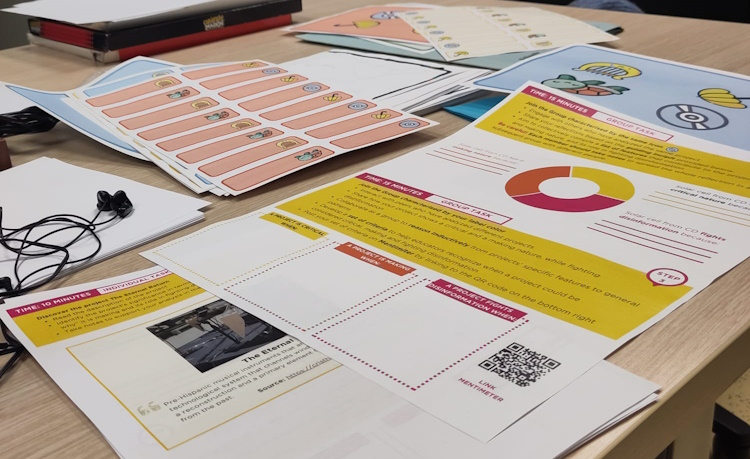

# Hands-on Workshop on Critical Making

Critical Making is a newly approved Erasmus+ Forward Looking Project, that will start on the 1st of January, 2024. In preparation for the project start, some partners (Politecnico di Torino, the Links Foundation and the Pädagogische Hochschule Weingarten) organized a hands-on activity, open to teachers of Politecnico di Torino and other collaborators of the TLlab. 

On December 7th, teachers gathered in the nice "Palazzina TLlab", the key space for all activities of the Teaching and Language Lab, and were guided by Flavio Renga and Chiara Ciociola (Links Foundation) in the analysis of 4 different scenarios that may contain scientifically inaccurate (or outright wrong) information. In a 3-step process, teachers were asked to identify the elements of "critical thinking", "making" and "disinformation" in one of the scenarios, to share their ideas in a group and synthesize them, and finally to start working on a possible definition for 'critical making' by reshuffling the groups and comparing ideas and insights. The 2-hour activity went out in a breeze, and the results presented by the moderators were intriguing and promising, and will be used as a starting point for the project activities.

<!-- truncate -->

More information:

- [News about the worksop on Politecnico di Torino's website](https://www.polito.it/ateneo/comunicazione-e-ufficio-stampa/appuntamenti/news?idn=22021)
- For more information contact the Teaching and Language Laboratory:  tllab@polito.it